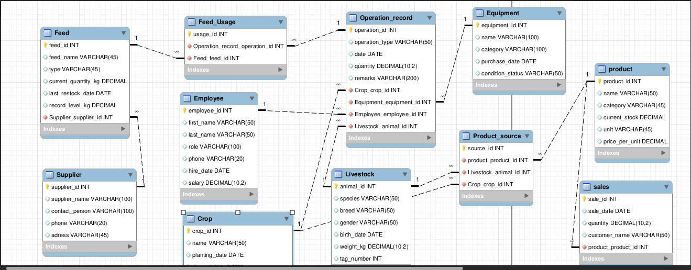

# Farm Database System Documentation


[](https://www.mysql.com/)

A comprehensive database system designed to manage all aspects of a university farm's operations, including crops, livestock, equipment, feed management, production tracking, and sales.

---

## 📋 Table of Contents

- [Project Overview](#project-overview)
- [Requirement Analysis](#requirement-analysis)
- [Conceptual Model](#conceptual-model)
- [Entity-Relationship Diagram](#entity-relationship-diagram)
- [Database Schema](#database-schema)
- [Installation Guide](#installation-guide)
- [Usage Examples](#usage-examples)
- [Contributing](#contributing)

---

## 🌾 Project Overview

The **Farm Database System** is a relational database designed to streamline and manage the daily operations of a university-owned farm. This system provides a centralized platform for tracking agricultural activities, managing resources, and analyzing farm productivity.

### Key Features

- **Employee Management** - Track farm staff, roles, and operational activities
- **Crop Management** - Monitor planting schedules, growth cycles, and harvest yields
- **Livestock Management** - Maintain animal health records, breeding information, and tracking
- **Equipment Tracking** - Manage farm equipment inventory and maintenance schedules
- **Feed Management** - Track feed inventory, suppliers, and usage patterns
- **Production Tracking** - Record products derived from crops and livestock
- **Sales Management** - Monitor product sales and customer transactions


### Objectives

✅ Record and manage farm operations performed by employees  
✅ Track crops, livestock, and equipment usage  
✅ Manage feed inventory and usage in farm operations  
✅ Track production of products derived from crops and livestock  
✅ Record sales transactions of farm products  
✅ Maintain supplier relationships and feed inventory  
✅ Ensure data consistency and integrity  
✅ Support efficient reporting and analytics  

---

## 📊 Requirement Analysis

### Functional Requirements

| ID | Requirement | Description |
|----|-------------|-------------|
| FR-01 | Employee Operations | Employees can log and track farm operations |
| FR-02 | Feed Management | Record feed usage for livestock and inventory tracking |
| FR-03 | Crop Tracking | Monitor crop growth, planting, and harvest schedules |
| FR-04 | Livestock Tracking | Track animal health, breeding, and maintenance activities |
| FR-05 | Equipment Management | Manage equipment inventory, usage, and condition |
| FR-06 | Production Recording | Track products produced from crops and livestock |
| FR-07 | Sales Transactions | Record customer purchases and sales data |


### Non-Functional Requirements

| Category | Requirement |
|----------|-------------|
| **Data Integrity** | Database must maintain ACID properties and referential integrity |
| **Normalization** | All tables must be normalized to Third Normal Form (3NF) |
| **Performance** | Queries should execute efficiently for reporting and analysis |
| **Scalability** | System should handle growing data volume without performance degradation |
| **Security** | Implement proper access controls and data validation |
| **Maintainability** | Clear schema design with proper documentation |

---

## 🗂️ Conceptual Model

### Entity Definitions

The database consists of 11 interconnected entities that represent the core components of farm operations.

#### 1. **Employee**
Represents farm staff members who perform various operations.

| Attribute | Type | Description |
|-----------|------|-------------|
| `employee_id` | INT (PK) | Unique identifier for each employee |
| `first_name` | VARCHAR(50) | Employee's first name |
| `last_name` | VARCHAR(50) | Employee's last name |
| `role` | VARCHAR(50) | Job role/position |
| `phone` | VARCHAR(20) | Contact phone number |
| `hire_date` | DATE | Date of employment |
| `salary` | DECIMAL(10,2) | Monthly salary |

#### 2. **Crop**
Stores information about planted crops and their lifecycle.

| Attribute | Type | Description |
|-----------|------|-------------|
| `crop_id` | INT (PK) | Unique identifier for each crop |
| `name` | VARCHAR(50) | Crop name (e.g., Wheat, Corn) |
| `variety` | VARCHAR(50) | Specific variety/cultivar |
| `planting_date` | DATE | Date when crop was planted |
| `harvest_date` | DATE | Expected/actual harvest date |
| `expected_yield_kg` | DECIMAL(10,2) | Projected yield in kilograms |
| `status` | VARCHAR(30) | Current status (Planted, Growing, Harvested) |

#### 3. **Livestock**
Tracks individual animals and their health information.

| Attribute | Type | Description |
|-----------|------|-------------|
| `animal_id` | INT (PK) | Unique identifier for each animal |
| `tag_number` | VARCHAR(20) (UNIQUE) | Physical identification tag number |
| `species` | VARCHAR(50) | Animal species (Cattle, Sheep, etc.) |
| `breed` | VARCHAR(50) | Specific breed |
| `gender` | VARCHAR(10) | Male/Female |
| `birth_date` | DATE | Date of birth |
| `weight_kg` | DECIMAL(10,2) | Current weight in kilograms |
| `health_status` | VARCHAR(50) | Health condition |

#### 4. **Equipment**
Manages farm machinery and tools inventory.

| Attribute | Type | Description |
|-----------|------|-------------|
| `equipment_id` | INT (PK) | Unique identifier for each equipment |
| `equipment_name` | VARCHAR(50) | Name of equipment |
| `category` | VARCHAR(50) | Type (Tractor, Harvester, etc.) |
| `purchase_date` | DATE | Date of acquisition |
| `condition_status` | VARCHAR(30) | Current condition (Good, Needs Repair) |

#### 5. **Supplier**
Stores information about feed suppliers.

| Attribute | Type | Description |
|-----------|------|-------------|
| `supplier_id` | INT (PK) | Unique identifier for each supplier |
| `supplier_name` | VARCHAR(50) | Company/supplier name |
| `contact_person` | VARCHAR(50) | Primary contact name |
| `phone` | VARCHAR(20) | Contact phone number |
| `address` | VARCHAR(100) | Physical address |

#### 6. **Feed**
Tracks feed inventory and suppliers.

| Attribute | Type | Description |
|-----------|------|-------------|
| `feed_id` | INT (PK) | Unique identifier for each feed type |
| `feed_name` | VARCHAR(50) | Name of feed product |
| `type` | VARCHAR(30) | Feed category |
| `quantity_kg` | DECIMAL(10,2) | Available quantity in kilograms |
| `supplier_id` | INT (FK) | Reference to supplier |

#### 7. **Product**
Represents farm products available for sale.

| Attribute | Type | Description |
|-----------|------|-------------|
| `product_id` | INT (PK) | Unique identifier for each product |
| `name` | VARCHAR(50) | Product name |
| `category` | VARCHAR(50) | Product category |
| `unit` | VARCHAR(20) | Unit of measurement |
| `price_per_unit` | DECIMAL(10,2) | Selling price |

#### 8. **Sale**
Records customer transactions and sales.

| Attribute | Type | Description |
|-----------|------|-------------|
| `sale_id` | INT (PK) | Unique identifier for each sale |
| `product_id` | INT (FK) | Reference to product sold |
| `customer_name` | VARCHAR(50) | Customer name |
| `quantity` | DECIMAL(10,2) | Quantity sold |
| `sale_date` | DATE | Date of transaction |

#### 9. **Operation_Record**
Logs all farm operations performed by employees.

| Attribute | Type | Description |
|-----------|------|-------------|
| `operation_id` | INT (PK) | Unique identifier for each operation |
| `operation_type` | VARCHAR(50) | Type of operation (Planting, Feeding, etc.) |
| `operation_date` | DATE | Date of operation |
| `employee_id` | INT (FK) | Employee who performed operation |
| `crop_id` | INT (FK, NULL) | Related crop (if applicable) |
| `animal_id` | INT (FK, NULL) | Related animal (if applicable) |
| `equipment_id` | INT (FK, NULL) | Equipment used (if applicable) |
| `quantity` | DECIMAL(10,2) | Quantity involved in operation |
| `remarks` | VARCHAR(255) | Additional notes |

#### 10. **Production_Source**
Links products to their sources (crops or livestock).

| Attribute | Type | Description |
|-----------|------|-------------|
| `source_id` | INT (PK) | Unique identifier for each source record |
| `product_id` | INT (FK) | Reference to product |
| `crop_id` | INT (FK, NULL) | Source crop (if applicable) |
| `animal_id` | INT (FK, NULL) | Source animal (if applicable) |

#### 11. **Feed_Usage**
Tracks feed consumption in operations.

| Attribute | Type | Description |
|-----------|------|-------------|
| `usage_id` | INT (PK) | Unique identifier for each usage record |
| `operation_id` | INT (FK) | Reference to operation |
| `feed_id` | INT (FK) | Reference to feed used |
| `quantity_kg` | DECIMAL(10,2) | Quantity used in kilograms |

### Relationships Summary

| Relationship | Cardinality | Description |
|--------------|-------------|-------------|
| Employee → Operation_Record | 1:M | One employee performs many operations |
| Crop → Operation_Record | 1:M | One crop has many operations |
| Livestock → Operation_Record | 1:M | One animal has many operations |
| Equipment → Operation_Record | 1:M | One equipment used in many operations |
| Supplier → Feed | 1:M | One supplier provides many feed types |
| Operation_Record → Feed_Usage | 1:M | One operation can use multiple feeds |
| Feed → Feed_Usage | 1:M | One feed type used in many operations |
| Crop → Production_Source | 1:M | One crop produces many products |
| Livestock → Production_Source | 1:M | One animal produces many products |
| Product → Production_Source | 1:M | One product has many sources |
| Product → Sale | 1:M | One product has many sales |

---

## 🔀 Entity-Relationship Diagram

The ERD illustrates the relationships between all entities in the system, showing how data flows from inputs (suppliers, employees) through operations to outputs (products, sales).

### Visual ERD



*Note: The diagram above shows the complete database schema with all relationships and cardinalities.*

### Text-Based ERD

```
┌─────────────────────────────────────────────────────────────────┐
│                        INPUT SIDE                                │
└─────────────────────────────────────────────────────────────────┘

SUPPLIER (1) ───────< (M) FEED

EMPLOYEE (1) ───────< (M) OPERATION_RECORD ──> (1) CROP
                              │
                              ├──> (1) LIVESTOCK
                              │
                              ├──> (1) EQUIPMENT
                              │
                              └───< (M) FEED_USAGE ──> (1) FEED

┌─────────────────────────────────────────────────────────────────┐
│                       OUTPUT SIDE                                │
└─────────────────────────────────────────────────────────────────┘

CROP (1) ───────< (M) PRODUCTION_SOURCE ──> (1) PRODUCT (1) ───────< (M) SALE
                                                      ↑
LIVESTOCK (1) ──< (M) PRODUCTION_SOURCE ──────────────┘
```

### Relationship Cardinalities

- **1:M** = One-to-Many
- **M:M** = Many-to-Many (resolved through junction tables)
- **(FK, NULL)** = Foreign key that allows NULL values (optional relationship)

---

## 💾 Database Schema

### SQL Creation Queries

Below are the complete SQL statements to create the database schema. Execute these in order to maintain referential integrity.

#### Step 1: Create Base Tables (No Foreign Keys)

```sql
-- =============================================
-- Employee Table
-- =============================================
CREATE TABLE Employee (
    employee_id INT PRIMARY KEY AUTO_INCREMENT,
    first_name VARCHAR(50) NOT NULL,
    last_name VARCHAR(50) NOT NULL,
    role VARCHAR(50) NOT NULL,
    phone VARCHAR(20),
    hire_date DATE NOT NULL,
    salary DECIMAL(10,2) CHECK (salary >= 0)
);

-- =============================================
-- Crop Table
-- =============================================
CREATE TABLE Crop (
    crop_id INT PRIMARY KEY AUTO_INCREMENT,
    name VARCHAR(50) NOT NULL,
    variety VARCHAR(50),
    planting_date DATE NOT NULL,
    harvest_date DATE,
    expected_yield_kg DECIMAL(10,2) CHECK (expected_yield_kg >= 0),
    status VARCHAR(30) DEFAULT 'Planted',
    CHECK (harvest_date IS NULL OR harvest_date >= planting_date)
);

-- =============================================
-- Livestock Table
-- =============================================
CREATE TABLE Livestock (
    animal_id INT PRIMARY KEY AUTO_INCREMENT,
    tag_number VARCHAR(20) UNIQUE NOT NULL,
    species VARCHAR(50) NOT NULL,
    breed VARCHAR(50),
    gender VARCHAR(10) CHECK (gender IN ('Male', 'Female')),
    birth_date DATE NOT NULL,
    weight_kg DECIMAL(10,2) CHECK (weight_kg > 0),
    health_status VARCHAR(50) DEFAULT 'Healthy'
);

-- =============================================
-- Equipment Table
-- =============================================
CREATE TABLE Equipment (
    equipment_id INT PRIMARY KEY AUTO_INCREMENT,
    equipment_name VARCHAR(50) NOT NULL,
    category VARCHAR(50) NOT NULL,
    purchase_date DATE NOT NULL,
    condition_status VARCHAR(30) DEFAULT 'Good'
);

-- =============================================
-- Supplier Table
-- =============================================
CREATE TABLE Supplier (
    supplier_id INT PRIMARY KEY AUTO_INCREMENT,
    supplier_name VARCHAR(50) NOT NULL,
    contact_person VARCHAR(50),
    phone VARCHAR(20),
    address VARCHAR(100)
);

-- =============================================
-- Product Table
-- =============================================
CREATE TABLE Product (
    product_id INT PRIMARY KEY AUTO_INCREMENT,
    name VARCHAR(50) NOT NULL,
    category VARCHAR(50) NOT NULL,
    unit VARCHAR(20) NOT NULL,
    price_per_unit DECIMAL(10,2) CHECK (price_per_unit >= 0)
);
```

#### Step 2: Create Tables with Foreign Keys

```sql
-- =============================================
-- Feed Table
-- =============================================
CREATE TABLE Feed (
    feed_id INT PRIMARY KEY AUTO_INCREMENT,
    feed_name VARCHAR(50) NOT NULL,
    type VARCHAR(30) NOT NULL,
    quantity_kg DECIMAL(10,2) CHECK (quantity_kg >= 0),
    supplier_id INT NOT NULL,
    FOREIGN KEY (supplier_id) REFERENCES Supplier(supplier_id)
        ON DELETE RESTRICT
        ON UPDATE CASCADE
);

-- =============================================
-- Sale Table
-- =============================================
CREATE TABLE Sale (
    sale_id INT PRIMARY KEY AUTO_INCREMENT,
    product_id INT NOT NULL,
    customer_name VARCHAR(50) NOT NULL,
    quantity DECIMAL(10,2) CHECK (quantity > 0),
    sale_date DATE NOT NULL,
    FOREIGN KEY (product_id) REFERENCES Product(product_id)
        ON DELETE RESTRICT
        ON UPDATE CASCADE
);

-- =============================================
-- Operation_Record Table
-- =============================================
CREATE TABLE Operation_Record (
    operation_id INT PRIMARY KEY AUTO_INCREMENT,
    operation_type VARCHAR(50) NOT NULL,
    operation_date DATE NOT NULL,
    employee_id INT NOT NULL,
    crop_id INT NULL,
    animal_id INT NULL,
    equipment_id INT NULL,
    quantity DECIMAL(10,2) DEFAULT 0,
    remarks VARCHAR(255),
    FOREIGN KEY (employee_id) REFERENCES Employee(employee_id)
        ON DELETE RESTRICT
        ON UPDATE CASCADE,
    FOREIGN KEY (crop_id) REFERENCES Crop(crop_id)
        ON DELETE SET NULL
        ON UPDATE CASCADE,
    FOREIGN KEY (animal_id) REFERENCES Livestock(animal_id)
        ON DELETE SET NULL
        ON UPDATE CASCADE,
    FOREIGN KEY (equipment_id) REFERENCES Equipment(equipment_id)
        ON DELETE SET NULL
        ON UPDATE CASCADE
);

-- =============================================
-- Production_Source Table
-- =============================================
CREATE TABLE Production_Source (
    source_id INT PRIMARY KEY AUTO_INCREMENT,
    product_id INT NOT NULL,
    crop_id INT NULL,
    animal_id INT NULL,
    FOREIGN KEY (product_id) REFERENCES Product(product_id)
        ON DELETE CASCADE
        ON UPDATE CASCADE,
    FOREIGN KEY (crop_id) REFERENCES Crop(crop_id)
        ON DELETE SET NULL
        ON UPDATE CASCADE,
    FOREIGN KEY (animal_id) REFERENCES Livestock(animal_id)
        ON DELETE SET NULL
        ON UPDATE CASCADE,
    CHECK (crop_id IS NOT NULL OR animal_id IS NOT NULL)
);

-- =============================================
-- Feed_Usage Table
-- =============================================
CREATE TABLE Feed_Usage (
    usage_id INT PRIMARY KEY AUTO_INCREMENT,
    operation_id INT NOT NULL,
    feed_id INT NOT NULL,
    quantity_kg DECIMAL(10,2) CHECK (quantity_kg > 0),
    FOREIGN KEY (operation_id) REFERENCES Operation_Record(operation_id)
        ON DELETE CASCADE
        ON UPDATE CASCADE,
    FOREIGN KEY (feed_id) REFERENCES Feed(feed_id)
        ON DELETE RESTRICT
        ON UPDATE CASCADE
);
```

#### Step 3: Create Indexes for Performance

```sql
-- Indexes for faster queries
CREATE INDEX idx_employee_role ON Employee(role);
CREATE INDEX idx_crop_status ON Crop(status);
CREATE INDEX idx_livestock_species ON Livestock(species);
CREATE INDEX idx_operation_date ON Operation_Record(operation_date);
CREATE INDEX idx_sale_date ON Sale(sale_date);
CREATE INDEX idx_feed_supplier ON Feed(supplier_id);
```

---

## 🚀 Installation Guide

### Prerequisites

- MySQL Server 8.0 or higher
- MySQL Workbench (recommended) or any MySQL client
- Basic knowledge of SQL

### Option 1: Using MySQL Workbench with ERD Model (Recommended)

This method uses the visual ERD model file (.mwb) to automatically create the database through forward engineering.

#### Step 1: Download the ERD Model File

1. Download the MySQL Workbench model file: [`farm_database.mwb`](assets/Updated_Farm_ERD.mwb)
2. Save it to a known location on your computer (e.g., Downloads folder or Documents)

#### Step 2: Open the Model in MySQL Workbench

1. Launch **MySQL Workbench**
2. Connect to your MySQL server instance (if not already connected)
3. Go to **File** → **Open Model...**
4. Navigate to the location where you saved `farm_database.mwb`
5. Select the file and click **Open**
6. The ERD diagram will appear in the main canvas area

#### Step 3: Review the Database Design

1. Explore the ERD diagram to understand the table structures and relationships
2. Click on individual tables to view their columns and properties
3. Review the relationship lines connecting the tables
4. You can zoom in/out using the mouse wheel or the zoom controls

#### Step 4: Forward Engineer the Database

1. In the top menu, click **Database** → **Forward Engineer...**
2. The **Forward Engineer to Database** wizard will open
3. **Connection Settings Page:**
   - Select your MySQL connection or configure a new one
   - Click **Next**
4. **Set Options for Database to be Created:**
   - Review the options (default settings are usually fine)
   - Ensure "Generate DROP SCHEMA" is checked if you want to recreate the database
   - Click **Next**
5. **Select Objects to Forward Engineer:**
   - Ensure all tables are checked (Employee, Crop, Livestock, Feed, etc.)
   - Click **Next**
6. **Review SQL Script:**
   - Review the generated SQL code that will be executed
   - This is your last chance to verify before creation
   - Click **Next**
7. **Execute Forward Engineering:**
   - Click **Execute** to create the database
   - Monitor the progress in the output window
   - Wait for "Forward engineering of schema completed successfully" message
8. Click **Close** when finished

#### Step 5: Verify the Database Creation

1. In the **Navigator** panel (left side), locate **Schemas**
2. Click the **Refresh** button (circular arrow icon)
3. Expand the **university_farm** database
4. You should see all 11 tables:
   - Employee
   - Crop
   - Livestock
   - Equipment
   - Supplier
   - Feed
   - Product
   - Sale
   - Operation_Record
   - Production_Source
   - Feed_Usage
5. Right-click on any table and select **Select Rows** to confirm it's ready for data insertion


### Verification Steps

After installation, verify the database setup:

```sql
-- Check all tables are created
SHOW TABLES;

-- Verify table structure
DESCRIBE Employee;
DESCRIBE Crop;
DESCRIBE Livestock;

-- Check relationships
SHOW CREATE TABLE Operation_Record;
```

---


### Common Queries

```sql
-- View all operations by employee
SELECT e.first_name, e.last_name, o.operation_type, o.operation_date
FROM Employee e
JOIN Operation_Record o ON e.employee_id = o.employee_id
ORDER BY o.operation_date DESC;

-- Track feed usage
SELECT f.feed_name, SUM(fu.quantity_kg) as total_used
FROM Feed f
JOIN Feed_Usage fu ON f.feed_id = fu.feed_id
GROUP BY f.feed_name;

-- Sales report
SELECT p.name, SUM(s.quantity) as total_sold, SUM(s.quantity * p.price_per_unit) as revenue
FROM Product p
JOIN Sale s ON p.product_id = s.product_id
GROUP BY p.product_id
ORDER BY revenue DESC;
```

---

## 📁 Project Structure

```
farm-db_documentation/
│
├── README.md                      # This documentation file
│
├── docs/
│   └── SAMPLE_DATA.sql            # Sample data for testing
│
└── assets/
  ├── ERD.png                      # ERD screenshot
  └── Updated_Farm_ERD.mwb         # MySQL Workbench model file

```


## 🤝 Contributing

Contributions are welcome! Please follow these guidelines:

1. Fork the repository
2. Create a feature branch (`git checkout -b feature/AmazingFeature`)
3. Commit your changes (`git commit -m 'Add some AmazingFeature'`)
4. Push to the branch (`git push origin feature/AmazingFeature`)
5. Open a Pull Request

---
## 👥 Authors

- **Visionary Nexus** - *Initial work* - [Jude-craft](https://github.com/jude-craft)

---


